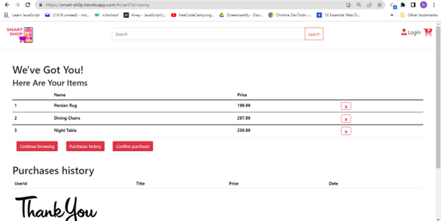
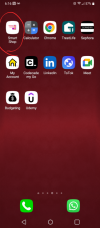

 # Smart Shop 💳
  
   
   
   
   
   
    
  
## Table-of-Contents
  
  1. [Title](#title)
  2. [Description](#description)
  3. [Installation](#Installation)
  4. [Usage](#usage)
  5. [Contribute](#contribute)
  6. [Technologies Used](#tests)
  7. [License](#license)
  8. [Github](#github)
  9. [Questions](#email)

## Title
  
   ### SMART SHOP
  

## Description 📃
  
  This project combines all four technologies of the MERN stack (MongoDB, Express.js, React, and Node.js) to build a social media application called Smart Shop. Users will be able to sign up and create an account, browse and add their products to cart, and checkout successfully, just like you might find in the e-commerce apps you use day in and day out in real life.

## Installation ✔️
  
- Installing NPM modules on both client and server folders

- Execute these commands from the project directory

`cd client && npm install`

`cd server && npm install`

## Usage 💻

  Open a terminal on server directory

  `npm run develop`

## Screenshots

## Demo clip

## Contributors 👨🏽‍💻
  
  
  
  1. [Reem Ahmed](https://github.com/ReemMDA99)
  2. [Palak Devgan](https://github.com/palakdevgan)
  3. [Satwinder Singh](https://github.com/satwinder191995)
  4. [Carson Somerville](https://github.com/csomervil) 
  5. [Kyle Baylis](https://github.com/kylebaylis)
  6. [Abdul Qadir](https://github.com/AbdulQadir51)

## Technologies 💡

  This project fulfills the following requirements:

- Use React for the front end.

- Use GraphQL with a Node.js and Express.js server.

- Use MongoDB and the Mongoose ODM for the database.

- Use queries and mutations for retrieving, adding, updating, and deleting data.

- Be deployed using Heroku (with data).

- Have a polished UI.

- Be responsive.

- Be interactive (i.e., accept and respond to user input).

- Include authentication (JWT).

- Protect sensitive API key information on the server.

- Have a clean repository that meets quality coding standards (file structure, naming conventions, best practices for class and id naming conventions, indentation, high-quality comments, etc.).

- Have a high-quality README (with unique name, description, technologies used, screenshot, and link to deployed application).
  

  ## License 🚩 
  
  
    This project is covered under the following license:
    
   
    
  
  ## GitHub 

  [GitHub](https://github.com/Project-3-Group-9/smart-shop)
  [Heroku](https://smart-sh0p.herokuapp.com/)

  ## Email 📬

  
- [Palak Devgan](m7.palak@gmail.com)

- [Reem Ahmed](reem.mda0909@gmail.com)

- [Kyle Baylis](kylejmbaylis@gmail.com)

- [Carson Somerville](carsonsomerville1@gmail.com)

- [Satwinder Singh](Satwinder47@outlook.com)

- [Abdul Qadir](abdulessa93@gmail.com)